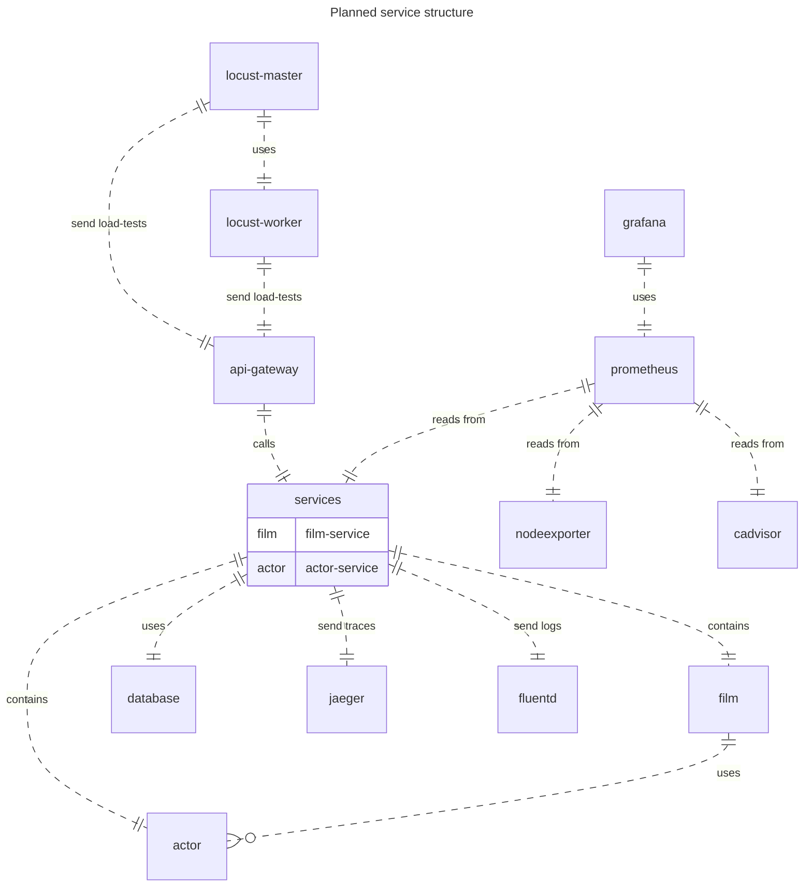

# Example Team Project

This project aims to create a more or less complete Microservice Architetcture based setup.

## Data structure

The database is coming from the [www.postgresqltutorial.com](https://www.postgresqltutorial.com/postgresql-getting-started/postgresql-sample-database/) website.

The page aims to learn how to use PostgreSQL, but the datastructure and the initial data in it fits perfectly for this small project.

## The application

The database tables provide a nice structure for a simple DVD Rental application where you can list Films with Actors or rent out a Film from your Inventory in a specific Store. 

## Planned setup

The project aims to use [Quarkus](https://quarkus.io/) with **reactive** setup where it is applicable. Native image is also one of the goals.

It also tries to build the necessary tools around it, like centralized logging, tracing with OpenTelemetry, metrics, etc...

## Planned Goals

* [Quarkus with Reactive and Native Image](docs/quarkus/index.md)
* Centralized logging 
  * EFK (Elasticsearch, Fluentd, Kibana) (_Check local docker setup below_)
* Tracing through OpenTelemetry
  * Jaeger (dev DB)
    * setup with Elasticsearch if possible
* Metrics
  * Micrometer
  * Prometheus
  * Grafana
* [API Gateway](https://github.com/Example-Team-Project/gateway-service) 
* Async communication
  * Kafka
  * Tracing through events (if possible)
* CI/CD (maybe)
  * try GitHub actions first
* [Local docker setup](https://github.com/Example-Team-Project/local-docker-setup#readme)
* Kubernetes deployment (maybe)